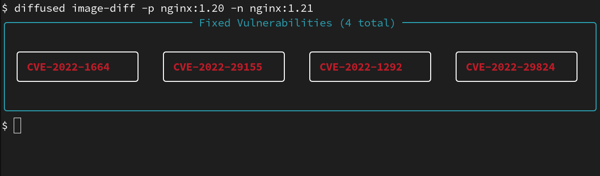

# Diffused

A vulnerability scan diffing tool for container images and SBOMs (Software Bill of Materials). Diffused helps track security improvements and regressions between different versions of container images by comparing SBOMs vulnerability scan results from SBOMs.

Its name comes from the pun `diff + used`, which means it performs the diffing of both results.

## Features

- 🔍 **Vulnerability Scanning**: Automated scanning of SBOMs using [Trivy](https://trivy.dev/)
- 📊 **SBOM Diffing**: Direct comparison of SPDX-JSON formatted SBOMs
- 📄 **Multiple Output Formats**: Support for both rich text and JSON output

## Getting started

### Prerequisites

1. **Install Trivy**: Follow the [official Trivy installation guide](https://aquasecurity.github.io/trivy/latest/getting-started/installation/)
2. **Python Environment**: Ensure Python 3.10+ is installed

### Installation

#### From Source

```bash
git clone https://github.com/konflux-ci/diffused.git
cd diffused
pip install -e .
```

### Usage

#### Compare Container Images

```bash
# Basic vulnerability diff between two container images
diffused image-diff -p ubuntu:20.04 -n ubuntu:22.04

# Get detailed information about each vulnerability
diffused image-diff -p nginx:1.20 -n nginx:1.21 --all-info

# Save output to JSON file
diffused image-diff -p app:v1.0 -n app:v2.0 --output json --file report.json
```

#### Compare SBOMs

```bash
# Compare two SBOM files
diffused sbom-diff -p previous.json -n current.json

# Get detailed vulnerability information
diffused sbom-diff -p old-sbom.json -n new-sbom.json --all-info

# Export to file with rich formatting
diffused sbom-diff -p v1-sbom.json -n v2-sbom.json --file vulnerability-report.txt
```

### CLI Commands and Options

| Command | Description |
|--------|-------|
| `image-diff` | Show the vulnerability diff between two container images. |
| `sbom-diff` | Show the vulnerability diff between two SBOMs. |

| Options | Short | Command | Description | Default |
|--------|--------|---------|-------------|---------|
| `--previous-image` | `-p` | `image-diff` | Previous container image URL | Required |
| `--next-image` | `-n` | `image-diff` | Next container image URL | Required |
| `--previous-sbom` | `-p` | `sbom-diff` | Previous SBOM file path | Required |
| `--next-sbom` | `-n` | `sbom-diff` | Next SBOM file path | Required |
| `--all-info` | `-a` | All | Show detailed vulnerability info | False |
| `--output` | `-o` | All | Output format (`rich`, `json`) | `rich` |
| `--file` | `-f` | All | Output file (use `-` for stdout) | `-` |

### Output Examples

#### Rich Format (Default)



#### Detailed Information


## Contributing

We welcome contributions! Refer to the [developer](./docs/developer.md) guide for instructions on getting started.

## Documentation

The documentation for the Diffused project is available in the [docs](/docs/) folder.

## License

Copyright 2025.

Licensed under the Apache License, Version 2.0 (the "License"); you may not use this file except in compliance with the License. You may obtain a copy of the License at

    http://www.apache.org/licenses/LICENSE-2.0

Unless required by applicable law or agreed to in writing, software distributed under the License is distributed on an "AS IS" BASIS, WITHOUT WARRANTIES OR CONDITIONS OF ANY KIND, either express or implied. See the License for the specific language governing permissions and limitations under the License.
